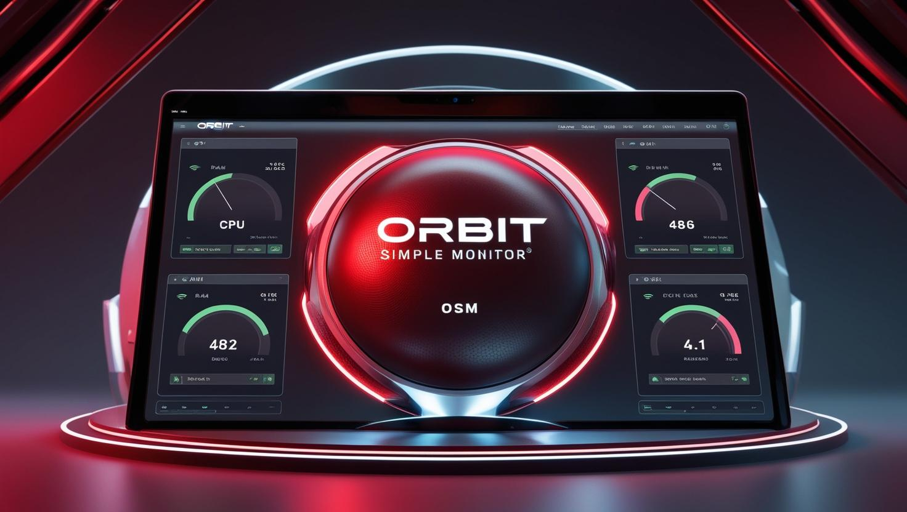

# **🛰 Orbit Simple Monitor (OSM) 🚀**  
**Lightweight server monitoring with Slack & Email alerts!**  

OSM is a **simple, lightweight** monitoring tool that tracks **CPU, RAM, and DISK** usage **on Linux Docker hosts**.  
It **logs everything**, **sends alerts** when usage spikes, and runs in a **tiny Docker container**.  

💾 **No need for Prometheus, Grafana, or heavy setups** – just plug and play!  
💡 **Built for developers & sysadmins** who want **fast, easy monitoring**.  

> 🛠 **Made with ❤️ in Senegal** 🇸🇳  

---

### 🌟 **Key Features**
✅ **Monitor your Linux host** (not just the container)  
✅ **Set usage thresholds** for CPU, RAM, and DISK  
✅ **Get real-time alerts** on **Slack & Email**  
✅ **Automatic log rotation** & **SQLite storage**  
✅ **Simple Docker Compose setup**  
✅ **Daily cleanup of old logs** (>30 days)  
✅ **Zero dependencies** – just Docker!  



---

## 🚀 **Quick Start (Docker)**
### **1️⃣ Works Only on Linux!** 🐧  
> 🚨 **OSM requires `/proc` to monitor the host system.**  
> **It will NOT work on Windows.**  

### **2️⃣ Run with Docker Compose**  
The easiest way to start OSM:

```yaml
version: '3.8'
services:
  osm:
    image: orbitturner/orbit-simple-monitor:latest
    container_name: osm-monitor
    environment:
      YOUR_SERVER_NAME: "Sama Server"
      DB_FILE: "/data/osm.db"
      CPU_THRESHOLD: 80
      RAM_THRESHOLD: 80
      DISK_THRESHOLD: 80
      CHECK_INTERVAL: 1
      CHECK_INTERVAL_UNIT: "m"
      SLACK_WEBHOOK_URL: "https://hooks.slack.com/services/XXX/YYY/ZZZ"
      ALERT_EMAIL: "alerts@example.com" # Multiple: "user1@example,user2@example"
      SMTP_SERVER: "smtp.example.com"
      SMTP_PORT: 587
      SMTP_USER: "user@example.com"
      SMTP_PASS: "secret"
      ALERT_CHANNELS: "SLACK,EMAIL"
    volumes:
      - ./osm_data:/data
      - /proc:/host_proc:ro  # Required for host-level monitoring
    restart: unless-stopped
```

Then:
```bash
docker-compose up -d
docker-compose logs -f
```

---

### **3️⃣ Run with Docker CLI**
Want a **quick one-liner**? Run OSM like this:

```bash
docker run --rm -it \
  -e YOUR_SERVER_NAME="Sama Server" \
  -e DB_FILE="/data/osm.db" \
  -e CPU_THRESHOLD=80 \
  -e RAM_THRESHOLD=80 \
  -e DISK_THRESHOLD=80 \
  -e CHECK_INTERVAL=1 \
  -e CHECK_INTERVAL_UNIT="m" \
  -e SLACK_WEBHOOK_URL="https://hooks.slack.com/services/XXX/YYY/ZZZ" \
  -e ALERT_EMAIL="alerts@example.com" \
  -e SMTP_SERVER="smtp.example.com" \
  -e SMTP_PORT=587 \
  -e SMTP_USER="user@example.com" \
  -e SMTP_PASS="secret" \
  -e ALERT_CHANNELS="SLACK,EMAIL" \
  --mount type=bind,source="$(pwd)/osm_data",target=/data \
  --mount type=bind,source=/proc,target=/host_proc,readonly \
  orbitturner/orbit-simple-monitor:latest
```

📌 **Mounts**:
- `/proc` → Required for **reading system metrics**.
- `/data` → Stores logs & the SQLite database.

---

## 📝 **Environment Variables**
| Variable               | Default              | Description |
|------------------------|----------------------|-------------|
| **`YOUR_SERVER_NAME`**   | `Sama Server`  | Server name in alerts. |
| **`DB_FILE`**            | `/data/osm.db`  | Path to database file. |
| **`CPU_THRESHOLD`**      | `90`  | Alert threshold for CPU usage (%) |
| **`RAM_THRESHOLD`**      | `90`  | Alert threshold for RAM (%) |
| **`DISK_THRESHOLD`**     | `90`  | Alert threshold for Disk (%) |
| **`CHECK_INTERVAL`**     | `1`   | Interval for checks (numeric) |
| **`CHECK_INTERVAL_UNIT`**| `m`   | Interval unit: `s`(sec), `m`(min), `h`(hour) |
| **`SLACK_WEBHOOK_URL`**  | _(empty)_  | Slack webhook URL for alerts. |
| **`ALERT_EMAIL`**        | `alerts@example.com` | Email or Emails (Comma separated list) for alerts. |
| **`SMTP_SERVER`**        | `smtp.example.com` | SMTP server. |
| **`SMTP_PORT`**          | `587`  | SMTP port (465 for SSL, 587 for TLS). |
| **`SMTP_USER`**          | `user@example.com` | SMTP username. |
| **`SMTP_PASS`**          | `secret` | SMTP password. |
| **`ALERT_CHANNELS`**     | `SLACK,EMAIL` | `SLACK`, `EMAIL`, or both. |

---

## 👨‍💻 **Developer Guide**
### **1️⃣ Run Locally (Without Docker)**
```bash
git clone https://github.com/orbitturner/orbit-simple-monitor.git
cd orbit-simple-monitor
python3 -m venv venv
source venv/bin/activate  # or venv\Scripts\activate on Windows
pip install -r requirements.txt
python osm.py
```

### **2️⃣ Run Tests**
```bash
pip install pytest
pytest
```

### **3️⃣ Build & Push Docker Image**
```bash
docker build -t osm-monitor .
docker tag osm-monitor orbitturner/orbit-simple-monitor:latest
docker push orbitturner/orbit-simple-monitor:latest
```

---

## **⚠️ Platform Compatibility**
| OS      | Supported? | Notes |
|---------|-----------|-----------------------------|
| **Linux** 🟢 | ✅ Yes | Fully supported. Mount `/proc` for host monitoring. |
| **Windows** 🔴 | ❌ No | **Not supported** (`/proc` missing). |
| **macOS** 🟡 | ⚠️ Limited | No host-level metrics (Docker limits access). |

---
---
## 🔐 Security Hardening Guide (For Paranoids & Hardcore Ops)  

If you're security-conscious and want to **lock down** OSM as much as possible, follow these additional hardening steps.  

### 🛡 1) Run OSM with **AppArmor** or **Seccomp**  
By default, Docker **seccomp** restricts syscalls. You can explicitly enforce a **custom security profile**:  
```yaml
    security_opt:
      - seccomp=your-seccomp-profile.json
      - apparmor=your-apparmor-profile
```
**Recommended**: Use the **default** seccomp profile unless you need extra restrictions.  


### 📦 2) Drop Unnecessary Capabilities  
Minimize privileges by dropping unneeded Linux capabilities:  
```yaml
    cap_drop:
      - ALL
    cap_add:
      - CHOWN       # Allow changing file ownership if needed for logging
      - SETUID      # Allow user switching if absolutely required
      - SETGID
```
If you don’t need user switching, remove `SETUID` and `SETGID`.


### 🔐 3) Enforce Read-Only FileSystem  
For extra security, make the **entire container read-only** except the necessary **data** directory:  
```yaml
    read_only: true
    tmpfs:
      - /tmp        # Allow temporary files to exist
    volumes:
      - ./osm_data:/data
```
This prevents **unexpected writes** to the container filesystem.


### 🦾 4) Restrict Networking (No Internet Access)  
If you don’t need OSM to **send alerts externally**, disable networking:  
```yaml
    network_mode: none
```
Otherwise, **allow only outbound connections** for SMTP/Slack alerts.


### 🏴‍☠️ 5) Prevent Privilege Escalation  
Ensure OSM cannot **gain root privileges** even if compromised:  
```yaml
    privileged: false
    user: "osm"
```
This blocks dangerous privilege escalations.


### 🔍 6) Audit Logs & Container Activity  
- Monitor container logs **(via external logging tools)**.  
- Use **Falco** or **Auditd** to detect suspicious activity inside the container.  
- Implement **fail2ban** rules for SMTP brute-force attacks (if public).  


### 🚨 7) Run OSM in a Firejail Sandbox (Extreme Security)  
For **maximum containment**, run OSM inside **Firejail**:  
```bash
firejail --noprofile --net=none docker run --rm --read-only orbitturner/orbit-simple-monitor
```
This isolates OSM even further from the host system.


### 🔒 Final Thoughts  
These steps provide **extra layers of security** beyond what is necessary for most users. If OSM runs in a **trusted internal network**, these **might be overkill**—but for **public-facing environments**, **better safe than sorry**! 🚀

---
---

## 💬 **Community & Support**
💡 **Found a bug? Need a feature?** Open an [issue](https://github.com/orbitturner/orbit-simple-monitor/issues)!  
🔧 **Pull requests welcome!** Follow our [contributing guide](./CONTRIBUTING.md).  

🚀 **Try it out & let us know!**  
Your server deserves **simple, efficient monitoring** without the bloat! 🔥  

---

### 🎯 **Links**
- 🌍 **Docker Hub**: [orbitturner/orbit-simple-monitor](https://hub.docker.com/r/orbitturner/orbit-simple-monitor)  
- 🛠 **GitHub**: [orbitturner/osm](https://github.com/orbitturner/osm)  

**Made with ❤️ in Senegal.** 🇸🇳  

